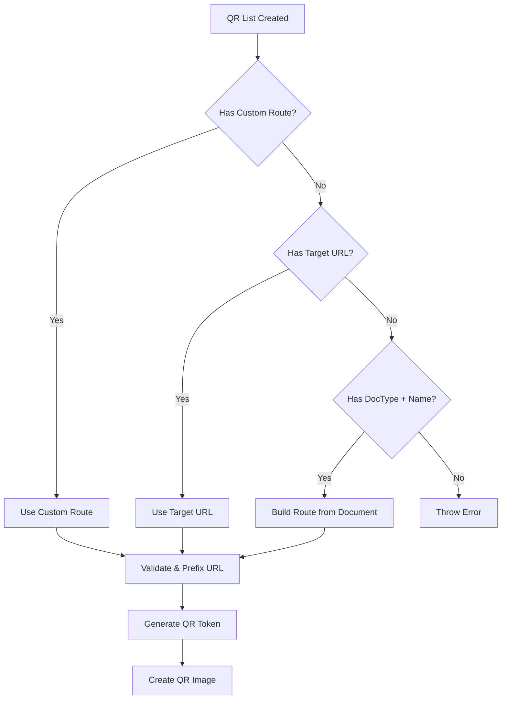
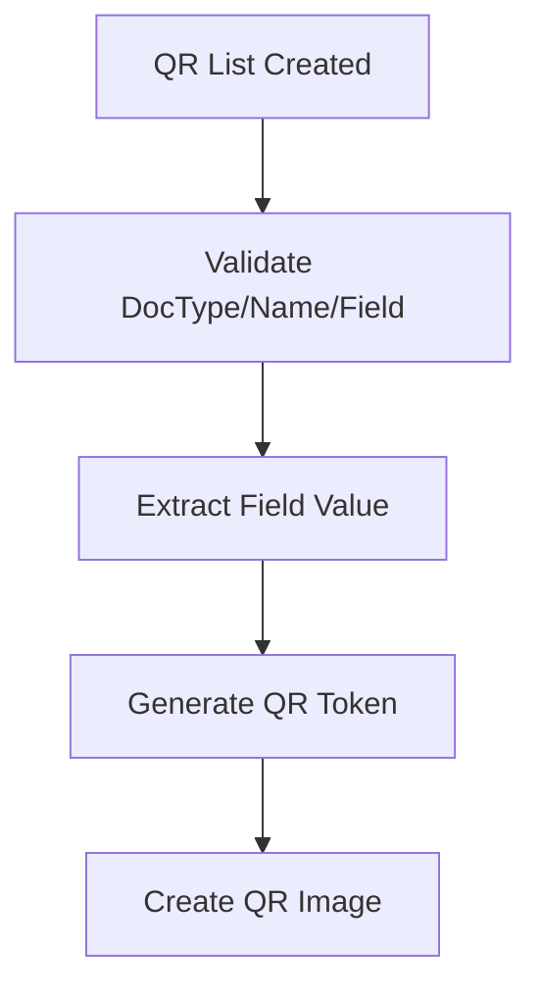

# QR Foundry Technical Documentation

**Author**: X-DESK (chotiputsilp.r@gmail.com)  
**Repository**: [https://github.com/BBbrighton/qr_foundry](https://github.com/BBbrighton/qr_foundry)

## Architecture Overview

QR Foundry implements a secure, token-based QR code generation system built on the Frappe Framework. The architecture follows a modular design with clear separation of concerns:

### Core Components

```
┌─────────────────┐    ┌─────────────────┐    ┌─────────────────┐
│   QR List       │────│   QR Token      │────│   QR Scan Log   │
│   (Management)  │    │   (Security)    │    │   (Audit)       │
└─────────────────┘    └─────────────────┘    └─────────────────┘
         │                       │                       │
         └───────────────────────┼───────────────────────┘
                                 │
                    ┌─────────────────┐
                    │   QR Services   │
                    │   (Generation)  │
                    └─────────────────┘
```

### Service Layer Architecture

```python
qr_foundry/
├── services/
│   ├── qr_ops.py      # QR generation and encoding logic
│   └── tokens.py      # Token management and security
├── utils/
│   ├── qr.py          # Low-level QR code generation
│   └── hello.py       # Test utilities and health checks
├── www/
│   └── qr/index.py    # Public QR resolution endpoint
└── api.py             # Public API endpoints
```

## QR Generation Workflow

### 1. Content Encoding Process

The system supports three distinct modes for QR content generation:

#### URL Mode Flow


#### Value Mode Flow


### 2. Token Security System

Every QR code is protected by a secure token system that provides:

#### Token Lifecycle
```
┌─────────────┐    ┌─────────────┐    ┌─────────────┐    ┌─────────────┐
│   Active    │───▶│  Scanning   │───▶│ Usage Check │───▶│   Status    │
│             │    │             │    │             │    │  Update     │
└─────────────┘    └─────────────┘    └─────────────┘    └─────────────┘
                                            │
                                            ▼
                              ┌─────────────────────────┐
                              │  Possible Outcomes:     │
                              │  • Redirect to target   │
                              │  • Return field value   │
                              │  • Show expired message │
                              │  • Show exhausted error │
                              └─────────────────────────┘
```

#### Atomic Operations
To prevent race conditions in high-concurrency environments:

```python
# Example from tokens.py
def atomic_increment_usage(token_name: str) -> tuple[bool, int]:
    """Atomically increment usage count and check limits"""
    with frappe.db.transaction():
        current = frappe.db.get_value("QR Token", token_name, 
                                    ["current_uses", "max_uses"], as_dict=True)
        if not current:
            return False, 0
            
        new_uses = current.current_uses + 1
        if current.max_uses > 0 and new_uses > current.max_uses:
            return False, current.current_uses
            
        frappe.db.set_value("QR Token", token_name, "current_uses", new_uses)
        return True, new_uses
```

## Field Resolution System

### Dynamic Field Population
The Value mode implements a sophisticated field resolution system:

```python
@frappe.whitelist()
def get_value_fields(doctype: str) -> list[dict]:
    """Return fields suitable for QR encoding with smart filtering"""
    suitable_fieldtypes = [
        "Data", "Small Text", "Text", "Int", "Float", "Currency", 
        "Percent", "Phone", "Email", "URL", "Barcode", "Code"
    ]
    
    fields = []
    meta = frappe.get_meta(doctype)
    
    for field in meta.fields:
        if field.fieldtype in suitable_fieldtypes and not field.hidden:
            fields.append({
                "label": f"{field.label or field.fieldname} ({field.fieldtype})",
                "value": field.fieldname
            })
    
    return sorted(fields, key=lambda x: x["label"])
```

### Client-Side Integration
The frontend dynamically updates field options:

```javascript
// From qr_list.js
value_doctype(frm) {
    if (frm.doc.value_doctype && frm.doc.qr_mode === "Value") {
        frappe.call({
            method: "qr_foundry.qr_foundry.doctype.qr_list.qr_list.get_value_fields",
            args: { doctype: frm.doc.value_doctype },
            callback: function(r) {
                if (r.message) {
                    const field = frm.get_field("value_field");
                    field.df.options = r.message.map(f => f.value).join("\n");
                    field.refresh();
                }
            }
        });
    }
}
```

## Security Implementation

### Token Generation Strategy

```python
def generate_secure_token(length: int = 32) -> str:
    """Generate cryptographically secure token"""
    import secrets
    import string
    
    alphabet = string.ascii_letters + string.digits
    return ''.join(secrets.choice(alphabet) for _ in range(length))
```

### Access Control Matrix

| Role | QR List | QR Token | QR Scan Log | Generate QR | View Reports |
|------|---------|----------|-------------|-------------|--------------|
| QR Manager | Full | Full | Read | Yes | Yes |
| System Manager | Full | Full | Full | Yes | Yes |
| User | Read Own | None | None | No | No |

### Permission Hooks

```python
# In hooks.py
permission_query_conditions = {
    "QR List": "qr_foundry.permissions.get_qr_list_conditions",
    "QR Token": "qr_foundry.permissions.get_qr_token_conditions"
}

def get_qr_list_conditions(user=None):
    """Filter QR Lists based on user permissions"""
    if not user:
        user = frappe.session.user
        
    if "QR Manager" in frappe.get_roles(user):
        return ""  # Access all
    
    return f"""(`tabQR List`.owner = '{user}')"""
```

## Database Schema Design

### QR List Structure
```sql
CREATE TABLE `tabQR List` (
    name VARCHAR(140) PRIMARY KEY,
    qr_mode VARCHAR(20) DEFAULT 'URL',
    label_text TEXT,
    
    -- URL Mode fields
    target_doctype VARCHAR(140),
    target_name VARCHAR(140),
    action VARCHAR(20) DEFAULT 'view',
    custom_route TEXT,
    target_url TEXT,
    
    -- Value Mode fields  
    value_doctype VARCHAR(140),
    value_name VARCHAR(140),
    value_field VARCHAR(140),
    
    -- Manual Mode fields
    manual_content LONGTEXT,
    
    -- Generated content
    qr_token VARCHAR(140),
    image VARCHAR(140),
    encoded_url TEXT,
    file_url TEXT,
    absolute_file_url TEXT,
    
    -- Standard Frappe fields
    creation DATETIME,
    modified DATETIME,
    owner VARCHAR(140),
    modified_by VARCHAR(140)
);
```

### QR Token Structure
```sql
CREATE TABLE `tabQR Token` (
    name VARCHAR(140) PRIMARY KEY,
    token VARCHAR(255) UNIQUE,
    qr_list VARCHAR(140),
    status VARCHAR(20) DEFAULT 'Active',
    expires_on DATE,
    max_uses INT DEFAULT 0,
    current_uses INT DEFAULT 0,
    
    -- Audit fields
    creation DATETIME,
    modified DATETIME
);
```

### QR Scan Log Structure
```sql
CREATE TABLE `tabQR Scan Log` (
    name VARCHAR(140) PRIMARY KEY,  -- LOG-{YYYY}-{MM}-{#####}
    token VARCHAR(140),
    scan_time DATETIME,
    user VARCHAR(140),
    ip_address VARCHAR(45),
    user_agent TEXT,
    validation_result VARCHAR(20),
    uses_at_scan INT,
    
    creation DATETIME
);
```

## Error Handling & Resilience

### Defensive Coding Patterns

The codebase implements robust error handling:

```python
def _get_field_value(dt: str, dn: str, fieldname: str) -> str:
    """Safely extract field value with fallback"""
    try:
        return frappe.db.get_value(dt, dn, fieldname) or ""
    except Exception:
        return ""

def _compute_encoded(row) -> tuple[str, str]:
    """Compute QR content with multiple fallback strategies"""
    # Use getattr with fallbacks for field name changes
    action = (getattr(row, "action", None) or 
              getattr(row, "target_action", None) or 
              "view").strip()
```

### Cache Resilience

```python
# From www/qr/index.py - handles different cache API versions
try:
    cache.set_value(key, 1 if ok else 0, expires_in_sec=300 if ok else 5)
except TypeError:
    # Fallback for older cache API
    cache.set_value(key, 1 if ok else 0, expires=300 if ok else 5)
```

## Performance Considerations

### QR Generation Optimization

```python
def generate_qr_png(data: str, size: int = 200, label: str = None) -> bytes:
    """Optimized QR generation with configurable parameters"""
    qr = qrcode.QRCode(
        version=1,              # Auto-sizing
        error_correction=qrcode.constants.ERROR_CORRECT_L,  # 7% correction
        box_size=10,            # Balance size vs quality
        border=4                # Standard border
    )
    
    qr.add_data(data)
    qr.make(fit=True)
    
    # Generate PIL image
    img = qr.make_image(fill_color="black", back_color="white")
    
    # Resize if needed
    if size != 200:
        img = img.resize((size, size), Image.Resampling.LANCZOS)
    
    # Convert to bytes
    buffer = BytesIO()
    img.save(buffer, format='PNG', optimize=True)
    return buffer.getvalue()
```

### Database Query Optimization

```python
# Efficient bulk operations
def cleanup_expired_tokens():
    """Batch cleanup of expired tokens"""
    expired_tokens = frappe.db.sql("""
        SELECT name FROM `tabQR Token` 
        WHERE status = 'Active' 
        AND expires_on < CURDATE()
        LIMIT 1000
    """, as_dict=True)
    
    if expired_tokens:
        token_names = [t.name for t in expired_tokens]
        frappe.db.sql("""
            UPDATE `tabQR Token` 
            SET status = 'Expired' 
            WHERE name IN ({})
        """.format(','.join(['%s'] * len(token_names))), token_names)
```

## Integration Patterns

### Print Format Integration

```html
<!-- Standard Print Format Integration -->

<div class="qr-code-section">
    <h4>QR Code</h4>
    
    
    <p class="qr-label">{{ doc.qr_list.label_text }}</p>
    
</div>

```

### Webhook Integration

```python
# Custom webhook for external systems
@frappe.whitelist()
def webhook_scan_notification(token: str, external_id: str = None):
    """Notify external systems of QR scans"""
    scan_log = frappe.get_last_doc("QR Scan Log", {"token": token})
    
    webhook_data = {
        "event": "qr_scanned",
        "timestamp": scan_log.scan_time,
        "token": token,
        "user": scan_log.user,
        "external_id": external_id
    }
    
    # Send to configured webhook URL
    webhook_url = frappe.get_single_value("QR Settings", "webhook_url")
    if webhook_url:
        requests.post(webhook_url, json=webhook_data, timeout=10)
```

## Testing Strategy

### Unit Tests

```python
class TestQRFoundry(unittest.TestCase):
    def setUp(self):
        self.qr_list = frappe.get_doc({
            "doctype": "QR List",
            "qr_mode": "URL",
            "target_doctype": "Sales Invoice",
            "target_name": "INV-001",
            "action": "view"
        }).insert()
    
    def test_url_mode_generation(self):
        """Test URL mode QR generation"""
        result = generate_direct_qr_for_qr_list(self.qr_list.name)
        self.assertTrue(result.get("absolute_file_url"))
        self.assertIn("/app/sales-invoice/INV-001", result.get("encoded_url", ""))
    
    def test_token_security(self):
        """Test token expiry and usage limits"""
        token = create_qr_token(self.qr_list.name, expires_in_days=1, max_uses=5)
        
        # Test usage increment
        for i in range(5):
            ok, uses = atomic_increment_usage(token["token"])
            self.assertTrue(ok)
            self.assertEqual(uses, i + 1)
        
        # Test exhaustion
        ok, uses = atomic_increment_usage(token["token"])
        self.assertFalse(ok)
```

### Integration Tests

```python
def test_end_to_end_workflow():
    """Test complete QR workflow from creation to scan"""
    # Create QR List
    qr_list = create_test_qr_list()
    
    # Generate QR
    result = generate_direct_qr_for_qr_list(qr_list.name)
    
    # Extract token from URL
    token = extract_token_from_url(result["encoded_url"])
    
    # Simulate scan
    scan_response = simulate_qr_scan(token)
    
    # Verify log creation
    logs = frappe.get_all("QR Scan Log", {"token": token})
    assert len(logs) == 1
```

## Monitoring & Observability

### Metrics Collection

```python
def collect_qr_metrics():
    """Collect usage metrics for monitoring"""
    return {
        "total_qr_codes": frappe.db.count("QR List"),
        "active_tokens": frappe.db.count("QR Token", {"status": "Active"}),
        "scans_today": frappe.db.count("QR Scan Log", {
            "scan_time": [">=", frappe.utils.today()]
        }),
        "expired_tokens": frappe.db.count("QR Token", {"status": "Expired"}),
        "modes_distribution": frappe.db.sql("""
            SELECT qr_mode, COUNT(*) as count 
            FROM `tabQR List` 
            GROUP BY qr_mode
        """, as_dict=True)
    }
```

### Health Checks

```python
@frappe.whitelist(allow_guest=True)
def health_check():
    """System health check endpoint"""
    try:
        # Test database
        frappe.db.sql("SELECT 1")
        
        # Test QR generation
        test_qr = generate_qr_png("test")
        
        # Test cache
        frappe.cache().set_value("health_check", "ok", expires_in_sec=10)
        
        return {"status": "healthy", "timestamp": frappe.utils.now()}
    except Exception as e:
        return {"status": "unhealthy", "error": str(e)}
```

## Future Enhancements

### Planned Features

1. **QR Templates**: Reusable templates with predefined settings
2. **Batch Generation**: Bulk QR code creation for large datasets  
3. **Analytics Dashboard**: Usage analytics and reporting
4. **Custom Actions**: User-defined QR scan behaviors
5. **Mobile App**: Dedicated scanning application
6. **API Rate Limiting**: Enhanced security controls
7. **Multi-tenant Support**: Organization-level segregation

### Extension Points

The architecture supports easy extension through:

- **Custom QR Modes**: Add new encoding types in `qr_ops.py`
- **Token Validators**: Custom validation logic in `tokens.py`
- **Scan Handlers**: Custom post-scan actions via hooks
- **Export Formats**: Additional image formats and sizes
- **Integration APIs**: External system connectors

This documentation provides a comprehensive technical overview of the QR Foundry system, covering architecture, security, performance, and extensibility considerations.

---

**Developed by X-DESK**  
For support and contributions, visit: [https://github.com/BBbrighton/qr_foundry](https://github.com/BBbrighton/qr_foundry)