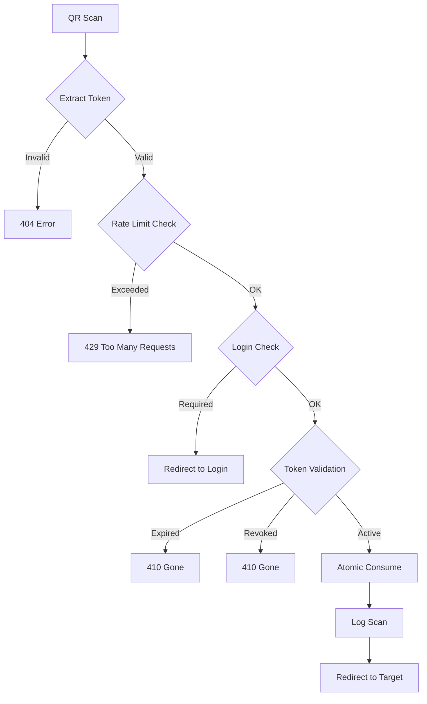

# QR Foundry Technical Documentation

**Author**: X-DESK (chotiputsilp.r@gmail.com)  
**Repository**: [https://github.com/BBbrighton/qr_foundry](https://github.com/BBbrighton/qr_foundry)  
**Version**: 2.0.0  
**Last Updated**: August 2025

## Architecture Overview

QR Foundry implements a secure, token-based QR code generation system built on the Frappe Framework. The architecture follows a modular design with clear separation of concerns and a single source of truth for QR generation.

### Core Components

```
┌─────────────────┐    ┌─────────────────┐    ┌─────────────────┐
│   QR Settings   │────│   QR List       │────│   QR Token      │
│  (Configuration)│    │   (Management)  │    │   (Security)    │
└─────────────────┘    └─────────────────┘    └─────────────────┘
         │                       │                       │
         └───────────────────────┼───────────────────────┘
                                 │
                    ┌─────────────────┐
                    │   QR Services   │
                    │  (Single Source) │
                    └─────────────────┘
                                 │
                    ┌─────────────────┐
                    │   QR Resolver   │────│  QR Scan Log  │
                    │   (www/qr)      │    │   (Audit)     │
                    └─────────────────┘    └───────────────┘
```

### Service Layer Architecture

```python
qr_foundry/
├── services/
│   ├── qr_ops.py      # Single source of truth for QR generation
│   └── tokens.py      # Token management (circular import safe)
├── utils/
│   ├── qr.py          # Low-level QR code generation
│   └── hello.py       # Test utilities and health checks
├── security.py        # RBAC implementation
├── print_helpers.py   # Print format integration
├── www/
│   └── qr/index.py    # Public QR resolution endpoint
├── api.py             # Public API endpoints
├── hooks.py           # App configuration
└── boot.py            # Session initialization
```

### Circular Import Prevention

The codebase implements guard imports to prevent circular dependencies:

```python
# From qr_ops.py - Guard import pattern
try:
    from qr_foundry.services.tokens import ensure_active_token_for_qr_list, build_token_resolver_url
except Exception:
    # tokens module may not be imported yet during partial deploys
    ensure_active_token_for_qr_list = None
    build_token_resolver_url = None
```

## Security Model (RBAC)

### Three-Tier Role System

QR Foundry implements a comprehensive Role-Based Access Control (RBAC) system:

| Role | Level | Permissions | Use Case |
|------|-------|------------|----------|
| **System Manager** | Admin | Full access, bypass all restrictions | System administration |
| **QR Manager** | Manager | Create/manage QR codes and tokens, view logs | QR code management |
| **QR User** | User | Generate/preview QR codes, no token access | Basic QR generation |

### Permission Matrix

| Operation | System Manager | QR Manager | QR User |
|-----------|---------------|------------|---------|
| Generate QR | ✅ | ✅ | ✅ |
| Preview QR | ✅ | ✅ | ✅ |
| Attach QR | ✅ | ✅ | ✅ |
| View QR List | ✅ | ✅ | ✅ (read only) |
| Manage Tokens | ✅ | ✅ | ❌ |
| View Scan Logs | ✅ | ✅ | ❌ |
| Configure Settings | ✅ | ❌ | ❌ |
| Bypass DocType Rules | ✅ | ❌ | ❌ |

### Security Implementation

```python
# From security.py
ALLOWED_GENERATOR_ROLES = {"System Manager", "QR Manager", "QR User"}

def ensure_generator():
    """Allow generate/preview for all three roles"""
    if _is_sysmgr():
        return
    roles = set(frappe.get_roles() or [])
    if not (roles & {"QR Manager", "QR User"}):
        frappe.throw(frappe._("Not allowed to generate QR codes."), frappe.PermissionError)

def ensure_manager():
    """Admin operations reserved for managers only"""
    if _is_sysmgr():
        return
    if "QR Manager" not in set(frappe.get_roles() or []):
        frappe.throw(frappe._("Only QR Manager may perform this action."), frappe.PermissionError)

def ensure_doctype_is_enabled(doctype: str):
    """Check if doctype is enabled in QR Settings (System Manager bypass)"""
    if _is_sysmgr():
        return  # System Manager bypasses all restrictions
    # Check QR Settings rules...
```

## QR Generation Modes

### Single Source of Truth

All QR generation flows through `compute_and_persist_encoded()` in qr_ops.py:

```python
def compute_and_persist_encoded(qr_list_doc) -> str:
    """
    SINGLE SOURCE OF TRUTH:
    - Token  -> ensure/issue token, set absolute '/qr?token=...'
    - Direct -> use custom_route if given, else build from doctype/name/action
    - Manual/Value -> use the provided value as-is (text), no URL validation
    Never fallback Token→Direct.
    """
```

### Mode Specifications

#### 1. URL Mode with Direct Link Type
- Generates direct URLs to Frappe documents
- Supports custom routes or auto-generated paths
- Actions: view, edit, print, report, custom_url

#### 2. URL Mode with Token Link Type
- Issues secure tokens for indirect access
- Immutable token content (final destination stored)
- No fallback to Direct mode
- Supports expiry, usage limits, rate limiting

#### 3. Manual Mode
- Arbitrary text content (no URL validation)
- Supports any QR-encodable content
- Use case: Serial numbers, product codes, custom data

#### 4. Value Mode
- Extracts field values from documents
- Smart field filtering by type
- Supported field types: Data, Text, Int, Float, Currency, Phone, Email, URL, Barcode, Code

### Mode-Aware Implementation

```python
# From qr_ops.py
qr_mode = (getattr(qr_list_doc, "qr_mode", None) or "URL").strip()
link_type = (getattr(qr_list_doc, "link_type", None) or "Direct").strip()

# TOKEN (for URL mode with Token link type)
if qr_mode == "URL" and link_type == "Token":
    # Issue token with immutable content
    raw = ensure_active_token_for_qr_list(qr_list_doc.name)
    encoded = build_token_resolver_url(raw)

# DIRECT (URL mode with Direct link type)
elif qr_mode == "URL" and link_type == "Direct":
    encoded = _build_route(...)
    
# MANUAL / VALUE (arbitrary text)
elif qr_mode in {"Manual", "Value"}:
    encoded = _get_manual_value(qr_list_doc)
```

## Token Management System

### Immutable Token Architecture

Tokens store the **final destination URL** in `encoded_content`, not the resolver URL:

```python
# From tokens.py
def issue_token_for_qr_list(qr_list_name: str):
    """Create token with immutable final destination"""
    qr = frappe.get_doc("QR List", qr_list_name)
    token = secrets.token_urlsafe(32)
    target_abs = get_url(_build_target_url_for_qr_list(qr))
    
    doc = frappe.get_doc({
        "doctype": "QR Token",
        "qr_list": qr_list_name,
        "token": token,
        "encoded_content": target_abs,  # <-- immutable final destination
        "status": "Active",
    })
```

### Token Lifecycle

```
┌─────────────┐    ┌─────────────┐    ┌─────────────┐
│   Active    │───▶│  Validated  │───▶│   Consumed  │
│             │    │  (checks)   │    │  (atomic)   │
└─────────────┘    └─────────────┘    └─────────────┘
       │                   │                  │
       ▼                   ▼                  ▼
   Expired            Rate Limited        Max Uses
   Revoked            Login Required       Reached
```

### Token Features

- **Immutable Content**: `encoded_content` cannot be changed after creation
- **Expiry Control**: Optional expiration date
- **Usage Limits**: Max uses with atomic increment
- **Rate Limiting**: Per-minute rate limits
- **Status Tracking**: Active/Revoked/Expired states
- **Audit Trail**: Last used timestamp, use count

## Database Schema

### QR List Structure (Updated)
```sql
CREATE TABLE `tabQR List` (
    name VARCHAR(140) PRIMARY KEY,
    
    -- Mode configuration
    qr_mode VARCHAR(20) DEFAULT 'URL',  -- URL/Value/Manual
    link_type VARCHAR(20) DEFAULT 'Direct',  -- Direct/Token (for URL mode)
    
    -- URL Mode fields
    target_doctype VARCHAR(140),
    target_name VARCHAR(140),
    action VARCHAR(20) DEFAULT 'view',
    print_format VARCHAR(140),
    custom_route TEXT,
    
    -- Value Mode fields  
    value_doctype VARCHAR(140),
    value_name VARCHAR(140),
    value_field VARCHAR(140),
    
    -- Manual Mode fields
    manual_content LONGTEXT,
    
    -- Common fields
    label_text TEXT,
    status VARCHAR(20) DEFAULT 'Active',
    
    -- Generated content
    encoded_url TEXT,  -- Computed by single source of truth
    image VARCHAR(140),
    file_url TEXT,
    absolute_file_url TEXT,
    
    -- Note: qr_token field REMOVED (1:N relationship managed via QR Token.qr_list)
    
    -- Standard Frappe fields
    creation DATETIME,
    modified DATETIME,
    owner VARCHAR(140),
    modified_by VARCHAR(140)
);
```

### QR Token Structure (Enhanced)
```sql
CREATE TABLE `tabQR Token` (
    name VARCHAR(140) PRIMARY KEY,
    token VARCHAR(255) UNIQUE,
    qr_list VARCHAR(140),  -- Link to parent QR List
    
    -- Immutable content
    encoded_content TEXT,  -- Final destination URL (immutable)
    label_text VARCHAR(255),
    
    -- Security controls
    status VARCHAR(20) DEFAULT 'Active',  -- Active/Revoked/Expired
    expires_on DATETIME,
    max_uses INT DEFAULT 0,  -- 0 = unlimited
    use_count INT DEFAULT 0,
    last_used_on DATETIME,
    rate_limit_per_min INT DEFAULT 0,  -- 0 = unlimited
    
    -- QR Image
    image VARCHAR(140),
    file_url TEXT,
    absolute_file_url TEXT,
    
    -- Notes
    notes TEXT,
    
    -- Audit fields
    creation DATETIME,
    modified DATETIME
);
```

### QR Settings Structure
```sql
CREATE TABLE `tabQR Settings` (
    name VARCHAR(140) PRIMARY KEY,  -- Single doctype
    
    -- Global configuration
    allowed_domains TEXT,  -- JSON array of allowed domains
    allow_localhost INT DEFAULT 1,
    rate_limit_per_ip_per_min INT DEFAULT 60,
    require_login INT DEFAULT 0,
    store_images_private INT DEFAULT 1,
    
    -- Rules (child table)
    -- See QR Settings Rule structure below
);

CREATE TABLE `tabQR Settings Rule` (
    name VARCHAR(140) PRIMARY KEY,
    parent VARCHAR(140),  -- Link to QR Settings
    parenttype VARCHAR(140) DEFAULT 'QR Settings',
    
    -- Rule configuration
    target_doctype VARCHAR(140),
    enabled INT DEFAULT 1,
    default_link_type VARCHAR(20) DEFAULT 'Direct',
    default_action VARCHAR(20) DEFAULT 'view',
    
    idx INT  -- Sort order
);
```

## API Reference

### Public API Endpoints

All endpoints require authentication and use RBAC security:

#### 1. preview_qr_list
```python
@frappe.whitelist()
def preview_qr_list(qr_list_name: str) -> dict:
    """Preview QR for existing QR List"""
    # Security: ensure_generator() - allows all three roles
    # Returns: {"data_uri": "data:image/png;base64,...", "qr_list": "QR-2025-00001"}
```

#### 2. attach_qr_list
```python
@frappe.whitelist()
def attach_qr_list(qr_list_name: str) -> dict:
    """Generate and attach QR image to QR List"""
    # Security: ensure_generator() + write permission
    # Returns: {"file_url": "/private/files/...", "qr_list": "QR-2025-00001"}
```

#### 3. generate_for_doc
```python
@frappe.whitelist()
def generate_for_doc(doctype: str, name: str) -> dict:
    """Find or create QR List for any document"""
    # Security: ensure_generator() + ensure_doctype_is_enabled()
    # Idempotent: Creates if not exists, updates if exists
    # Returns: {"qr_list": "QR-2025-00001"}
```

#### 4. preview_for_doc
```python
@frappe.whitelist()
def preview_for_doc(doctype: str, name: str) -> dict:
    """Preview QR for any document"""
    # Security: ensure_generator() + ensure_doctype_is_enabled() + read permission
    # Returns: {"data_uri": "data:image/png;base64,...", "qr_list": "QR-2025-00001"}
```

#### 5. attach_qr_to_doc
```python
@frappe.whitelist()
def attach_qr_to_doc(doctype: str, name: str) -> dict:
    """Attach QR as private file to source document"""
    # Security: ensure_generator() + ensure_doctype_is_enabled() + write permission
    # Returns: {"file_url": "/private/files/...", "file_name": "...", "qr_list": "QR-2025-00001"}
```

### Print Format Methods (Jinja)

#### 6. qr_src
```python
def qr_src(doctype: str, name: str) -> str:
    """Get QR image URL for print formats (smart fallback)"""
    # Usage in print format: {{ qr_src(doc.doctype, doc.name) }}
    # Returns: URL to attached image or data URI
    # Smart logic: Uses attached image if available, generates fresh if not
```

#### 7. qr_data_uri
```python
def qr_data_uri(doctype: str, name: str) -> str:
    """Generate fresh QR data URI for print formats"""
    # Usage in print format: {{ qr_data_uri(doc.doctype, doc.name) }}
    # Returns: "data:image/png;base64,..."
    # Always generates fresh QR (slower but current)
```

## QR Resolution System

### Resolver Architecture

The public resolver at `/qr` handles all QR code scans with comprehensive security:

```python
# www/qr/index.py structure
def get_context(context):
    """Main resolver entry point"""
    # 1. Extract and validate token
    # 2. Apply security checks (rate limiting, domain, login)
    # 3. Atomically consume token
    # 4. Log scan event
    # 5. Redirect or display content
```

### Security Features

1. **Rate Limiting**: Per-IP and per-token rate limits
2. **Domain Restrictions**: Configurable allowed domains
3. **Login Requirements**: Optional authentication for scans
4. **Atomic Token Consumption**: Database-level atomic operations
5. **Self-Healing**: Automatic correction of misconfigured tokens
6. **Comprehensive Logging**: Detailed audit trail with multiple result types

### Resolver Flow



## JavaScript Architecture

### Dual-Layer Approach

QR Foundry uses a two-layer JavaScript architecture:

1. **Global Layer** (`app_include_js`)
   - Universal buttons for all enabled doctypes
   - Loaded on every page
   - File: `/assets/qr_foundry/js/qr_foundry/buttons.js`

2. **DocType Layer** (`doctype_js`)
   - QR List specific functionality
   - Loaded only when QR List form opens
   - File: `/assets/qr_foundry/js/qr_foundry/qr_list_buttons.js`

### Configuration in hooks.py

```python
# Global buttons for all doctypes
app_include_js = [
    "/assets/qr_foundry/js/qr_foundry/buttons.js",
]

# QR List specific buttons
doctype_js = {
    "QR List": "public/js/qr_foundry/qr_list_buttons.js"
}

# Jinja methods for print formats
jinja = {
    "methods": [
        "qr_foundry.print_helpers.qr_src",
        "qr_foundry.print_helpers.qr_data_uri",
    ]
}
```

### Client-Side RBAC

JavaScript implements role-based button visibility:

```javascript
// From buttons.js
window.qr_foundry.user_has_qr_role = function () {
  const roles = (frappe.boot && frappe.boot.user && frappe.boot.user.roles) || [];
  return roles.includes("System Manager") || 
         roles.includes("QR Manager") || 
         roles.includes("QR User");
};

// Buttons only show for users with appropriate roles
if (window.qr_foundry.user_has_qr_role()) {
    window.qr_foundry.add_qr_buttons(frm);
}
```

### QR List Form Enhancements

The QR List form includes:
- **Preview QR**: Generate and display QR code
- **Regenerate & Attach**: Create new QR image file
- **View Tokens**: Navigate to filtered token list (Token mode, managers only)
- **Token Count Display**: Shows active/total tokens in form intro

## Utility Functions

### QR Generation Utilities

```python
# utils/qr.py
def generate_qr_png(data: str, size: int = 200, label: str = None) -> bytes:
    """Generate QR code PNG with optional label"""
    # Uses qrcode library with optimized settings
    # Returns PNG bytes

def make_data_uri(png_bytes: bytes) -> str:
    """Convert PNG to data URI for inline display"""
    # Returns: "data:image/png;base64,..."
```

### Print Format Helpers

```python
# print_helpers.py
def qr_src(doctype: str, name: str) -> str:
    """Get QR image URL for print formats (uses attached image if available)"""
    # Smart fallback: attached image -> fresh generation
    # Use in print formats: {{ qr_src(doc.doctype, doc.name) }}

def qr_data_uri(doctype: str, name: str) -> str:
    """Generate QR data URI for Jinja templates (always fresh)"""
    # Use in print formats: {{ qr_data_uri(doc.doctype, doc.name) }}

def embed_file(file_name_or_url: str) -> str:
    """Embed file as data URI with security validation"""
    # Path traversal protection included
```

### Security Utilities

```python
# security.py
def mask_token(raw: str) -> str:
    """Mask token for display: 'abcd...wxyz'"""
    
def rate_limit_generation(max_per_user_per_day: int | None = None):
    """Per-user daily generation limits (managers exempt)"""
```

## Configuration

### QR Settings

Central configuration hub for QR Foundry:

1. **Global Settings**
   - Allowed domains for resolver
   - Rate limiting configuration
   - Login requirements
   - Privacy settings (private/public images)

2. **DocType Rules**
   - Enable/disable doctypes for QR generation
   - Default link type (Direct/Token)
   - Default action (view/edit/print)

3. **Boot Session Integration**
   - Enabled doctypes loaded into `frappe.boot.qr_foundry_rule_doctypes`
   - Used by client-side JavaScript for button visibility

### Environment Variables

```bash
# Optional configuration
QR_FOUNDRY_DEBUG=1  # Enable debug logging
QR_FOUNDRY_MAX_IMAGE_SIZE=500  # Maximum QR image size in pixels
```

## Print Format Integration

QR Foundry provides two Jinja methods for seamless print format integration:

### Method 1: qr_src (Recommended)

Uses attached QR images when available, with smart fallback to generation:

```html
<!-- Simple integration -->
<div class="qr-section">
    
</div>

<!-- With error handling -->


<div class="qr-container">
    
    <p style="text-align: center; font-size: 10px; margin: 5px 0;">Scan for details</p>
</div>

```

### Method 2: qr_data_uri (Always Fresh)

Generates QR code on every print (slower but always current):

```html
<!-- Always generates fresh QR -->
<div class="qr-section">
    
</div>
```

### Advanced Integration with QR List Data

Access QR List properties for enhanced formatting:

```html
<!-- With label and custom styling -->

    
    <div style="position: absolute; top: 50px; right: 50px; text-align: center;">
        
        
            <p style="font-size: 10px; margin: 5px 0; font-weight: bold;">{{ qr_list.label_text }}</p>
        
        <p style="font-size: 8px; color: #666;">{{ doc.doctype }} {{ doc.name }}</p>
    </div>

    <!-- Fallback if QR List doesn't exist -->
    <div style="position: absolute; top: 50px; right: 50px;">
        
    </div>

```

### Performance Considerations

| Method | Speed | Use Case |
|--------|-------|----------|
| `qr_src` | Fast | Production prints (uses cached images) |
| `qr_data_uri` | Slower | Always fresh QR needed |

### Multi-Document Print Formats

For list prints with multiple documents:

```html

    <div class="item-row">
        <div class="item-details">{{ item.item_name }}</div>
        <div class="item-qr">
            
        </div>
    </div>

```

### Responsive Print Layout

```html
<style>
.qr-section {
    float: right;
    margin: 10px;
    text-align: center;
}
.qr-section img {
    max-width: 120px;
    height: auto;
    border: 1px solid #ccc;
}
@media print {
    .qr-section {
        break-inside: avoid;
    }
}
</style>

<div class="qr-section">
    
    <br><small>{{ doc.name }}</small>
</div>
```

## Migration Guide

### Upgrading from v1.x to v2.0

#### Breaking Changes

1. **Removed qr_token field from QR List**
   - Migration: Use QR Token doctype with qr_list link
   - View tokens via "View Tokens" button on QR List form

2. **No Token→Direct fallback**
   - Migration: Explicitly set link_type for each QR List
   - Token mode always uses tokens, no automatic fallback

3. **RBAC Implementation**
   - Migration: Assign QR User, QR Manager roles as needed
   - System Manager retains full access

#### Database Migration

Run patches after update:
```bash
bench --site [site-name] migrate
bench --site [site-name] clear-cache
```

#### Client Script Updates

Legacy client scripts are automatically cleaned up via patches.

## Error Handling

### Structured Error Responses

All errors follow consistent patterns:

```python
frappe.throw(
    message=_("Descriptive error message"),
    title=_("Error Category"),
    exc=SpecificException  # e.g., frappe.PermissionError
)
```

### Common Error Scenarios

| Error | Cause | Resolution |
|-------|-------|------------|
| "Not allowed to generate QR codes" | Missing role | Assign QR User/Manager role |
| "DocType not enabled for QR Foundry" | DocType not in rules | Add to QR Settings rules |
| "Token expired or not found" | Invalid/expired token | Generate new QR |
| "Rate limit exceeded" | Too many requests | Wait and retry |
| "Manual/Value QR requires non-empty value" | Empty content | Provide valid content |

## Performance Optimization

### Caching Strategy

- Token validation results cached for 5 minutes (success) or 5 seconds (failure)
- Enabled doctypes cached in boot session
- QR images stored as files (not regenerated on each request)

### Database Optimization

- Indexes on frequently queried fields (token, qr_list, status)
- Atomic operations for token consumption
- Batch operations for cleanup tasks

### Image Optimization

```python
# Optimized PNG generation
img.save(buffer, format='PNG', optimize=True)
```

## Development Utilities

### Test Cleanup Script

Located at `qr_foundry/dev_utils/cleanup_script.py`:

```python
# Usage in bench console
exec(open('/path/to/cleanup_script.py').read())

# Configuration
DRY_RUN = True  # Set False to execute
TEST_USERS = ["qr.manager@example.com", ...]
TARGETS = [("Item", "TEST-001"), ...]
```

### Health Check

```python
# Check system health
frappe.call("qr_foundry.utils.hello.health_check")
# Returns: {"status": "healthy", "timestamp": "..."}
```

## Monitoring & Observability

### Event Logging

Structured logging throughout the codebase:

```python
logger.info({
    "event": "computed_encoded",
    "qr_list": qr_list_doc.name,
    "qr_mode": qr_mode,
    "link_type": link_type,
    "encoded_kind": "token" if "/qr?token=" in encoded else "direct",
})
```

### Metrics Collection

```python
# Collect usage metrics
metrics = {
    "total_qr_codes": frappe.db.count("QR List"),
    "active_tokens": frappe.db.count("QR Token", {"status": "Active"}),
    "scans_today": frappe.db.count("QR Scan Log", {
        "creation": [">=", frappe.utils.today()]
    })
}
```

### Audit Trail

Complete audit trail via QR Scan Log:
- Token used
- Scan timestamp
- User identity
- IP address
- User agent
- Result (success/expired/rate_limited/etc.)

## Security Best Practices

### Path Traversal Protection

```python
# From print_helpers.py
site_root = frappe.get_site_path()
file_path = frappe.get_site_path(file_doc.get_full_path())
if os.path.commonpath([site_root, file_path]) != site_root:
    frappe.throw("Invalid file path.", title="Security")
```

### URL Validation

```python
# From qr_ops.py
_ALLOWED_SCHEMES = {"http", "https"}

def _is_safe_route(route: str) -> bool:
    if route.startswith("/"):
        return True  # Site-relative OK
    parsed = urlparse.urlparse(route)
    return parsed.scheme in _ALLOWED_SCHEMES and bool(parsed.netloc)
```

### Token Security

- 32-byte cryptographically secure tokens
- Immutable content after creation
- Atomic consumption to prevent race conditions
- Rate limiting at multiple levels

## Future Enhancements

### Planned Features

1. **Bulk Operations**: Mass QR generation for multiple documents
2. **QR Templates**: Reusable configurations
3. **Analytics Dashboard**: Usage statistics and insights
4. **Webhook Integration**: External system notifications
5. **Custom Validators**: Extensible validation logic
6. **Mobile SDK**: Native mobile scanning

### Extension Points

The architecture supports extensions via:

- **Custom Modes**: Add new QR modes in `qr_ops.py`
- **Token Validators**: Custom validation in `tokens.py`
- **Scan Handlers**: Post-scan hooks in resolver
- **Security Guards**: Additional checks in `security.py`

## Troubleshooting

### Common Issues

1. **"View Tokens" button not appearing**
   - Ensure QR Mode = URL and Link Type = Token
   - Verify user has QR Manager or System Manager role
   - Clear browser cache after changes

2. **Circular import errors**
   - Guard imports are in place
   - Run `bench clear-cache` after code changes

3. **QR not generating**
   - Check QR Settings for enabled doctypes
   - Verify user roles and permissions
   - Check browser console for JavaScript errors

4. **Token consumption failures**
   - Check rate limits in QR Settings
   - Verify token status (not expired/revoked)
   - Review QR Scan Log for details

5. **Print format QR not showing**
   - Verify `bench clear-cache` was run after adding Jinja methods
   - Check that DocType is enabled in QR Settings
   - Ensure document exists before calling `qr_src`
   - Use `qr_data_uri` for debugging if `qr_src` fails

6. **QR image broken in print**
   - For attached images: Check if QR was generated and attached
   - For data URIs: Verify network access during print generation
   - Use browser developer tools to inspect image source

### Debug Mode

Enable debug logging:
```python
logger = frappe.logger("qr_foundry")
logger.setLevel(logging.DEBUG)
```

## Support & Contribution

For support, bug reports, and contributions:
- GitHub: [https://github.com/BBbrighton/qr_foundry](https://github.com/BBbrighton/qr_foundry)
- Email: chotiputsilp.r@gmail.com

### Contributing

1. Fork the repository
2. Create a feature branch
3. Follow existing code patterns
4. Add tests for new features
5. Submit a pull request

---

**QR Foundry v2.0** - Enterprise QR Code Management for Frappe/ERPNext  
**Developed by X-DESK**  
Licensed under MIT License